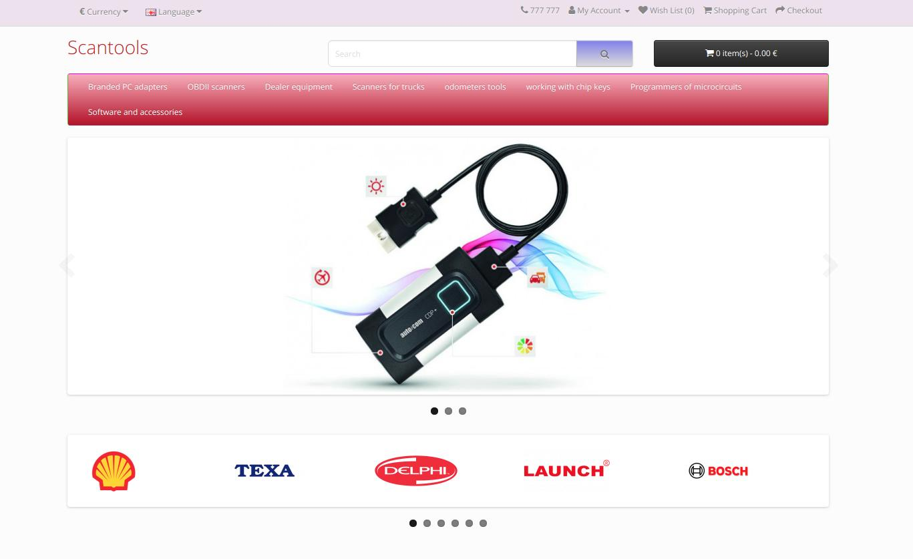
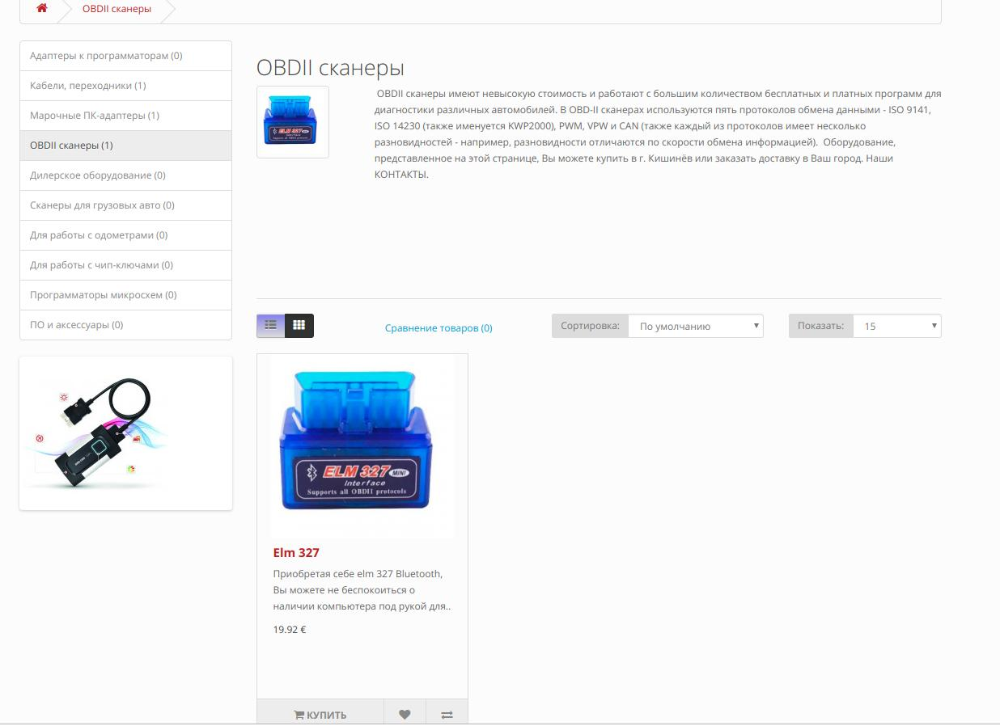
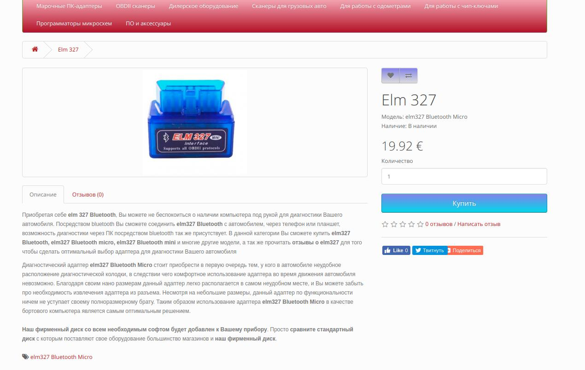
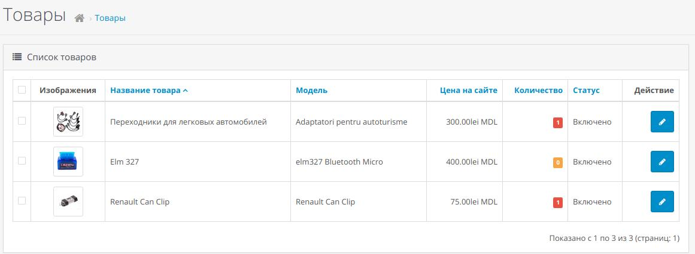
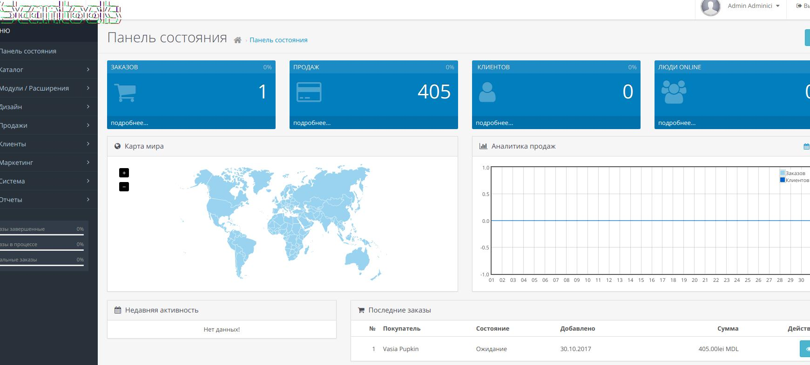

you can test this site onlinks below: 

http://89.149.81.39
http://89.149.81.39/admin/

https://89.149.81.39
https://89.149.81.39/admin/

### how to set up MYSQL
--------------------
```
1. mysql -u root -p (grand rood access to mysql, it's not rooted on UNIX)
2. create database opencart_dev;
3. show databases;


4. create user 'username'@'localhost'
5. grant all priveleges on *.* to 'username'@'localhost'

it's all db and user a created


=======
4. create user 'pdobos'@'localhost'<br>
5. grant all privileges on *.* to 'pdobos'@'localhost'<br>
```
it's all db and user a created

<br>

My version of the site is with changed CSS style, changed logos to <b>"SCAN TOOLS"</b>, and added Russian, Rominia to English, as well.
<br>

Changed some Index in the database.
Also, it's destinated on MariaDB engine.
<br>





<b>Have Fun!</b>

